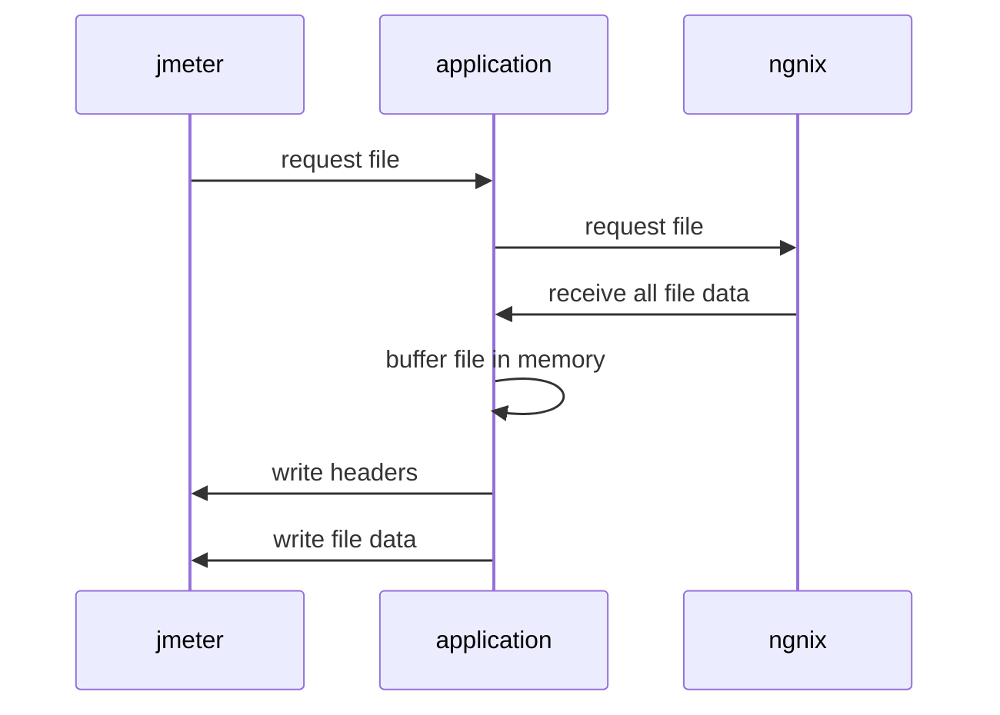
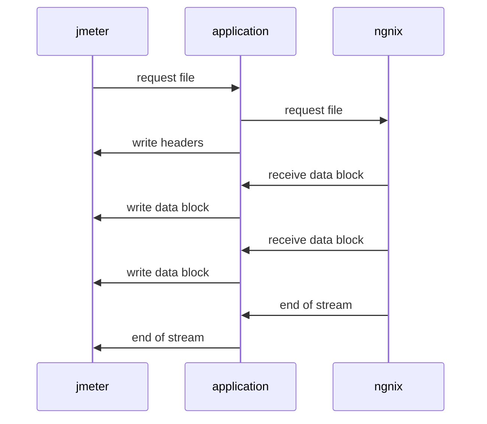

# spring-streaming-poc

Showcase of streaming files over spring boot backend using blocking and non-blocking techniques.

The project contains 4 flavours of the application providing the file API
* Netty blocking
* Netty non-blocking
* Tomcat blocking
* Tomcat streaming

## The naive approach - Blocking

## The Non-blocking/streaming approach

## Requirements 
* [OpenJDK 21](https://adoptium.net/temurin/releases/)
* [Docker](https://www.docker.com/)
* [JMeter](https://jmeter.apache.org/)

## How to run
1. Build the bootJars `./gradlew build` 
2. Package the images `docker compose build`
3. Run the stack `docker compose up`
4. Put some load on it `jmeter -n -t jmeter/Streaming_PDF.jmx -l results/result.jtl -e -o results`
5. Inspect the HTML report / view docker logs to see any errors

## Pitfalls
* JMeter out of memory, check your available memory to JMeter in "apache-jmeter-{version}/bin/jmeter", update the following line by adding a larger max heap space `: "${HEAP:="-Xms1g -Xmx10g -XX:MaxMetaspaceSize=256m"}"`
